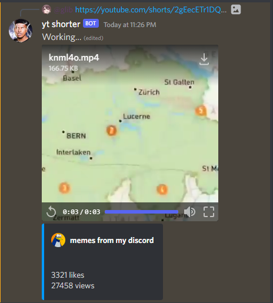

<br/>
<p align="center">
  <h3 align="center">Youtube Short Embeder</h3>

  <p align="center">
    Converts youtube short links to a discord attatchment
    <br/>
    <br/>
  </p>
</p>

    

## Table Of Contents

* [About the Project](#about-the-project)
* [Getting Started](#getting-started)
  * [Prerequisites](#prerequisites)
  * [Installation](#installation)
* [Roadmap](#roadmap)
* [Contributing](#contributing)
* [License](#license)

## About The Project


Converts youtube short links to a discord attatchment

## Getting Started


### Prerequisites

Make sure you have NodeJS 12+

### Installation

1. Clone the repo

```sh
git clone https://github.com/dragongoose/video-auto-embed.git
```

2. Install NPM packages

```sh
npm install
```

3. Fill out the config.ts file

```TS
import {Config} from './src/types';

export const config: Config = {
  token: 'DISCORD TOKEN',
  prefix: '?',
  intents: INTENT_INTEGER_HERE,
  colorPrimary: '#F2F3F5',
};

```

## Roadmap

See the [open issues](https://github.com/dragongoose/video-auto-embed/issues) for a list of proposed features (and known issues).

## Contributing

Contributions are what make the open source community such an amazing place to be learn, inspire, and create. Any contributions you make are **greatly appreciated**.
* If you have suggestions for adding or removing projects, feel free to [open an issue](https://github.com/dragongoose/video-auto-embed/issues/new) to discuss it, or directly create a pull request after you edit the *README.md* file with necessary changes.
* Please make sure you check your spelling and grammar.
* Create individual PR for each suggestion.

### Creating A Pull Request

1. Fork the Project
2. Create your Feature Branch (`git checkout -b feature/AmazingFeature`)
3. Commit your Changes (`git commit -m 'Add some AmazingFeature'`)
4. Push to the Branch (`git push origin feature/AmazingFeature`)
5. Open a Pull Request

## License

Distributed under the GPL-3.0 License.

